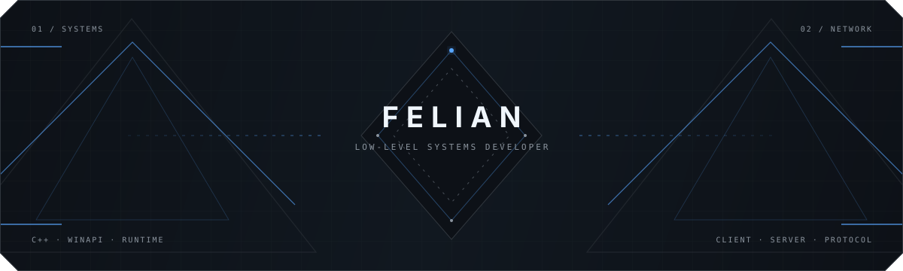

<div align="center">



<br />

<code>LOW-LEVEL</code>&nbsp;&nbsp;&nbsp;<code>WINDOWS</code>&nbsp;&nbsp;&nbsp;<code>RUNTIME</code>&nbsp;&nbsp;&nbsp;<code>NETWORKING</code>

</div>

<br />

## GitHub Statistics

<div align="center">


</div>

<br />

## About

I build software close to the system: native runtimes, Windows internals,
networked architectures, real-time interfaces and audio pipelines.

My work is grounded in a simple idea — understand the whole system, keep the
architecture explicit, and make every abstraction earn its place.

<br />

## Skills

```text
SYSTEMS     C++ · Low-Level Development · Windows Internals · WinAPI
RUNTIME     Reverse Engineering · DLL · Memory · Runtime Development
NETWORK     Client–Server Architecture · Networking
GRAPHICS    UI · Graphics · Dear ImGui
SCRIPTING   Lua · sol2 · LuaJIT
AUDIO       Audio · DSP · Real-Time Processing
```

<br />

## Principles

```cpp
namespace thedel0rean {
    constexpr auto understand = "the system, not only the abstraction";
    constexpr auto measure    = "before optimizing";
    constexpr auto build      = "fast, reliable, explicit";
}
```

<br />

<div align="center">

<sub>FROM MEMORY TO INTERFACE — BUILT AS ONE SYSTEM</sub>

</div>
